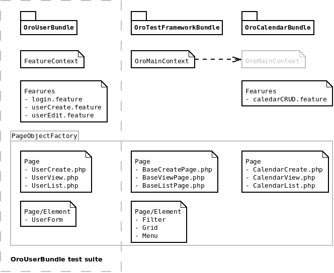

# Behat Tests

### Before you start

***Behavior-driven development (BDD)*** is a software development process that emerged from test-driven development (TDD).
Behavior-driven development combines the general techniques and principles of TDD 
with ideas from domain-driven design and object-oriented analysis and design to provide software development and management teams 
with shared tools and a shared process to collaborate on software development. [Read more at Wiki](https://en.wikipedia.org/wiki/Behavior-driven_development)

***Behat*** is a Behavior Driven Development framework for PHP. [See more at behat documentation](http://docs.behat.org/en/v3.0/)

***Mink*** is an open source browser controller/emulator for web applications, written in PHP. [Mink documentation](http://mink.behat.org/en/latest/)


***Page Object Extension*** provides tools for implementing [page object pattern](http://www.seleniumhq.org/docs/06_test_design_considerations.jsp#page-object-design-pattern).
Also see [Page Object Extension documentation](http://behat-page-object-extension.readthedocs.org/en/latest/index.html)

***Symfony2 Extension*** provides integration with Symfony2. [See Symfony2 Extension documentation](https://github.com/Behat/Symfony2Extension/blob/master/doc/index.rst)

***@OroTestFrameworkBundle\Behat\ServiceContainer\OroTestFrameworkExtension*** provides integration with Oro BAP based applications. 

***Selenium2Driver*** Selenium2Driver provides a bridge for the Selenium2 (webdriver) tool. See [Driver Feature Support](http://mink.behat.org/en/latest/guides/drivers.html)

***Selenium2*** browser automation tool with object oriented API. 

***PhantomJS*** is a headless WebKit scriptable with a JavaScript API. 
It has fast and native support for various web standards: DOM handling, CSS selector, JSON, Canvas, and SVG.

### Installing

Install behat dependencies:

```php
require behat/behat:3.1.0 behat/mink-extension:^2.0 behat/mink-selenium2-driver:1.* sensiolabs/behat-page-object-extension:dev-master bossa/phpspec2-expect:~1.0 behat/symfony2-extension:2.1.1
```

### Architecture

Mink provide ```MinkContext``` with basic feature steps.
```OroMainContext``` is extended from ```MinkContext``` and add many additional steps for features. 
```OroMainContext``` it's a shared context that present in every test suite.

To look the all available feature steps:

```bash
bin/behat -dl -s OroUserBundle
```

Every bundle has its own test suite and can be run separately:

 ```bash
 bin/behat -s OroUserBundle
 ```

For building testing suites ```Oro\Bundle\TestFrameworkBundle\Behat\ServiceContainer\OroTestFrameworkExtension``` is used.
During initialization, Extension will create test suite with bundle name if any ```Tests/Behat/Features``` directory exits.
Thus, if bundle has no Features directory - no test suite would be crated for it.

If you need some specific feature steps for your bundle you should create ```Tests/Behat/Context/FeatureContext``` class.
Instead of ```OroMainContext``` FeatureContext will be used for bundle test suite.
Perhaps FeatureContext may be extended from OroMainContext for reload some feature steps.

Page Object Extension provide ```PageObjectAware``` interface for injecting PageObjectFactory that know about all pages and elements in application.
Read more about ([how using the page object factory](http://behat-page-object-extension.readthedocs.org/en/latest/guide/working_with_page_objects.html#using-the-page-object-factory))





### Configuration

Base configuration is holded by [behat.yml.dist](../../config/behat.yml.dist).
Use it by parameter ```-p``` for example:

```bash
bin/behat -s OroUserBundle -p ./src/Oro/src/Oro/Bundle/TestFrameworkBundle/Resources/config/behat.yml.dist
```

You can copy it to behat.yml to the root of project and edit it for your needs.
Every bundle that configured symfony_bundle suite type will not be autoloaded by ```OroTestFrameworkExtension```. 
See ***Architecture*** reference above

### Write your first feature

Every bundle should hold its own features at ```{BundleName}/Tests/Behat/Features/``` directory
Every feature it's a single file with ```.feature``` extension and some specific syntax (See more at [Cucumber doc reference](https://cucumber.io/docs/reference))

A feature has three basic elements—the Feature: keyword, a name (on the same line) 
and an optional (but highly recommended) description that can span multiple lines.

A scenario is a concrete example that illustrates a business rule. It consists of a list of steps.
In addition to being a specification and documentation, a scenario is also a test. 
As a whole, your scenarios are an executable specification of the system.

A step typically starts with ***Given***, ***When*** or ***Then***. 
If there are multiple Given or When steps underneath each other, you can use ***And*** or ***But***. 
Cucumber does not differentiate between the keywords, but choosing the right one is important for the readability of the scenario as a whole.

Get look at login.feature in OroUserBundle - [UserBundle/Tests/Behat/Features/login.feature](../../../../UserBundle/Tests/Behat/Features/login.feature)

```gherkin
Feature: User login
  In order to login in application
  As an OroCRM admin
  I need to be able to authenticate

Scenario: Success login
  Given I open "Login" page
  And I fill "Login Form" with:
      | Username | admin |
      | Password | admin |
  And I press "Log in"
  And I should be on "Home" page

Scenario: Fail login
  Given I open "Login" page
  And I fill "Login Form" with:
      | Username | user |
      | Password | pass |
  And I press "Log in"
  And I should be on "Login" page
  And I should see "Invalid user name or password."
```

1. ```Feature: User login``` starts the feature and gives it a title.
2. Behat does not parse the next 3 lines of text. (In order to... As an... I need to...). 
These lines simply provide context to the people reading your feature, 
and describe the business value derived from the inclusion of the feature in your software.
3. ```Scenario: Success login``` starts the scenario, 
and contains a description of the scenario.
4. The next 6 lines are the scenario steps, each of which is matched to a regular expression defined in Context. 
5. ```Scenario: Fail login``` starts the next scenario, and so on.

### Run tests

For execute features you need browser emulator demon (Selenium2 or PhantomJs) runing.

For PhantomJs:

```bash
wget https://bitbucket.org/ariya/phantomjs/downloads/phantomjs-2.1.1-linux-x86_64.tar.bz2 -O $HOME/travis-phantomjs/phantomjs-2.1.1-linux-x86_64.tar.bz2
tar -xvf $HOME/travis-phantomjs/phantomjs-2.1.1-linux-x86_64.tar.bz2 -C $HOME/travis-phantomjs
ln -s $HOME/travis-phantomjs/phantomjs-2.1.1-linux-x86_64/bin/phantomjs /usr/bin/phantomjs
```

Run PhantomJs:

```bash
phantomjs --webdriver=8643 > /tmp/phantomjs.log 2>&1 &
```

For Selenium2

```bash
curl -L http://selenium-release.storage.googleapis.com/2.52/selenium-server-standalone-2.52.0.jar > $HOME/selenium-server-standalone-2.52.0/selenium.jar
```

Run Selenium2:

```bash
java -jar $HOME/selenium-server-standalone-2.52.0/selenium.jar -log /tmp/webdriver.log > /tmp/webdriver_output.txt 2>&1 &
```

Now run tests:

```bash
vendor/bin/behat
```
